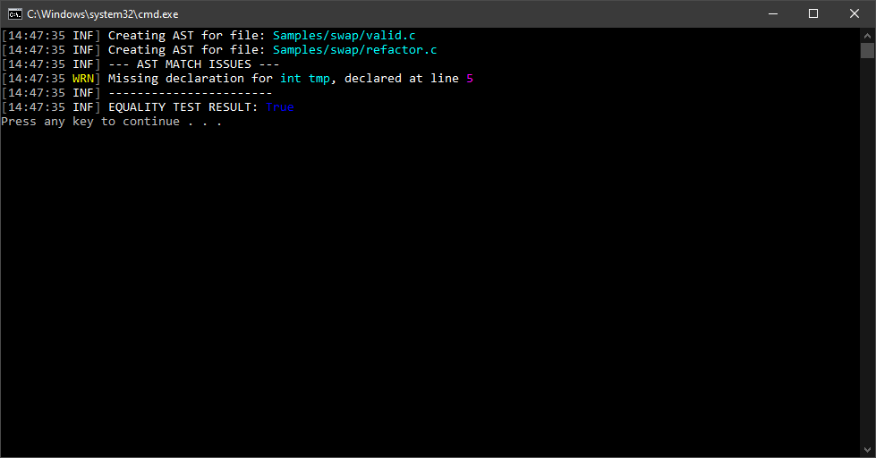

# LINVAST.Imperative.Comparers

[](https://github.com/LINVAST/LINVAST.Imperative.Comparers/issues)
[](https://github.com/LINVAST/LINVAST.Imperative.Comparers/releases)
[](https://github.com/LINVAST/LINVAST.Imperative.Comparers/releases)
[](https://nuget.org/packages/LINVAST.Imperative.Comparers)

**This is a "PoC" project made to show how easy it is to implement logic on top of LINVAST ASTs and shows all the benefits of LINVAST. The logic is not complete and therefore using it in your own projects is not advised.**

Simple imperative AST comparer library written on top of LINVAST. Made to be extensible and manageable long-term. Available as a NuGet package.

## Used libraries/tools
- [ANTLR4](https://www.antlr.org/)
- [MathNET.Symbolics](https://symbolics.mathdotnet.com/)

## Examples (using CLI tool):
Several examples can be found in the  directory. One sample will be shown below.

```sh 
$ linvast cmp
ERROR(S):
  A required value not bound to option name is missing.

  -v, --verbose    Set output to verbose messages.

  --help           Display this help screen.

  --version        Display version information.

  value pos. 0     Required. Specification path.

  value pos. 1     Required. Test source path.
```

### Example for swap sources

Sources:  

```sh
$ linvast cmp Samples/swap/valid.c Samples/swap/wrong.c
```


Sources:  

```sh
$ linvast cmp Samples/swap/valid.psc Samples/swap/wrong.c
```


Sources:   (*Note: Overflow is not checked at the moment*)

```sh
$ linvast cmp Samples/swap/valid.c Samples/swap/refactor.c
```




# Extending library with new comparers

Steps:
- Create new comparer class in the `LINVAST.Imperative.Comparers` namespace
- Extend `ASTNodeComparerBase<T>` base class where `T` is the type of `ASTNode` you wish to implement

Comparers created in this way will be automatically picked up by `ASTNodeComparer` class via reflection.

Comparers can (and it is encouraged for them to) use already existing comparers in their logic. Check out some of the already written  as an example.
